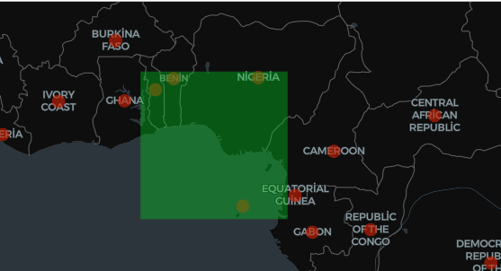

# Mekansal Sorgular 

## Range Query (Aralık Sorgusu)

RangeQuery, coğrafi pencereye dayalı sorgular için optimize edilmiştir.Büyük veri kümeleri için hızlı bir yöntemdir.

SpatialRangeQuery, sorgu penceresi ile geometri arasındaki ilişkiler için aşağıdaki ifadeleri destekler:

CONTAINS
INTERSECTS
WITHIN
COVERS
COVERED_BY
OVERLAPS
CROSSES
TOUCHES
EQUALS
 

Örnek kullanım: 

#Verimizi yükleyeim:
countries = PointRDD(sc, "data/countries.csv", 3, FileDataSplitter.CSV,True)

countries.spatialPartitioning(GridType.KDBTREE)

countries.buildIndex(IndexType.RTREE, True)

query_envelope = Envelope(0, 10, 0, 10)
consider_boundary_intersection = False  
using_index = False

result = RangeQuery.SpatialRangeQuery(
	countries,
	query_envelope,   
	consider_boundary_intersection,       	 
	using_index         	 
)

#Sonucumuzu görmek için:
result_list = result.collect()
for item in result_list:
	print(item)

Kodu incelersek; 

Oluşturduğumuz sorgu penceresi ve kullandığımız ülke verisi ile oluşan görüntü aşağıdaki şekildedir: 

Sorgu penceremizin içinde kalan noktalar görselde görüldüğü gibi Nijerya, Benin ve isimleri gözükmeyen Togo ile Sao Tome adasıdır. 

Çıktımız: 

Çıktığımız beklendiği gibi oluşturduğumuz pencere içerisindeki noktaları verdi.

Yaptıklarımızı incelersek:

countries.spatialPartitioning(GridType.KDBTREE)
Spatial Partitioning başlığı altında bu konu anlatıldı, mekansal bölümlendirme yaparak sorgumuzun verimini arttırdık. Bölümlendirmeyi yaparken GridType.KDBTREE ile K-Dimensional Tree (K-D Tree) algoritmasını kullandık.

countries.buildIndex(IndexType.RTREE, True) 
Bölümlendirilmiş verilere mekansal index ekleyerek sorgunun daha hızlı çalışmasını sağladık. R-Tree indeks türünü kullandık. *****(Sonradan detaylandırılacak)*****

 

## En Yakın Komşu Sorgusu (Nearest Neighbor Query)

Sorgulanan noktaya en yakın geometrik nesneleri bulmak için kullanılır.

KNNQuery.SpatialKnnQuery()

KNNQuery.SpatialKnnQuery() sorgu noktasına en yakın k adet geometri nesnesini belirlemek için kullanılır. Parametre olarak; sorguda kullanılacak SpatialRDD, sorgu noktası, en yakın kaç adet komşu geometrinin istendiği ve mekansal indexin kullanılıp kullanılmayacağını belirten bir boolean değer alır.

Not: Euclidean mesafe dikkate alınır.
Not: Liste formatında çıktı verir.

Örnek üzerinden incelersek:

ulkeler_rdd = PointRDD(sc,"data/countries.csv",3,FileDataSplitter.CSV,True,10)

nokta = Point(50, 150)
k = 5
index_kullanım = False
knn_sonuc = KNNQuery.SpatialKnnQuery(ulkeler_rdd, nokta, k, index_kullanım)

knn_sonuc

Çıktımız:

[Geometry: Point userData: Japan	0.8710133265462459	0.0,
 Geometry: Point userData: Taiwan*	0.7494197917813127	0.0,
 Geometry: Point userData: Philippines	0.8795214658806055	0.0,
 Geometry: Point userData: Mongolia	0.7127164027485121	0.0,
 Geometry: Point userData: China	0.8788265963780304	0.0]

Sorguladığımız noktaya en yakın ülkelere ulaşmış olduk. 
Bu ülkelerin userData yerine lokasyon bilgilerini de incelersek:

for i, geom in enumerate(knn_sonuc):
	point = geom.geom  
	x = point.x  
	y = point.y
	print(f"Point {i+1}: X = {x}, Y = {y}")

Point 1: X = 36.5748441, Y = 139.2394179
Point 2: X = 23.9739374, Y = 120.9820179
Point 3: X = 12.7503486, Y = 122.7312101
Point 4: X = 46.8250388, Y = 103.8499736
Point 5: X = 35.000074, Y = 104.999927

(50, 150) noktasına en yakın noktaların bunlar olduğunu görmekteyiz. 

## Mekansal Birleşim Sorgusu (Spatial Join Query)
İki SpatialRDD için, birindeki geometriler ile diğerindeki geometriler arasındaki kesişim veya kapsama ilişkilerine kontrol eder ve eşleşmeleri döndürür. 

Not: İki SpatialRDD’nin geometrileri aynı tür olmak zorunda değildir.
 

5.4 Mesafe Birleşim Sorgusu (Distance Join Query)
İki SpatialRDD için (A ve B) mesafe bazlı ilişkileri kontrol eder. A’daki her bir geometri için belirtilen mesafe içerisindeki B’deki geometriler seçilir ve eşleşen sonuçlar döndürülür.

Not: İki SpatialRDD’nin geometrileri aynı tür olmak zorunda değildir.

Not: Mesafe birleşim sorgusu sadece COVERED_BY ve INTERSECTS ilişkilerini destekler.

Örnek kullanım:
