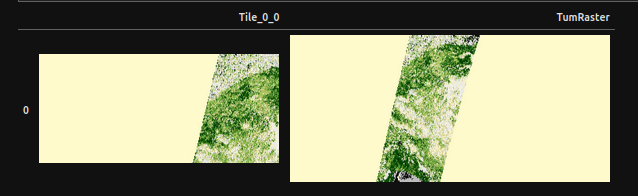

# Sedona Raster SQL
Apache Sedona ilk sürümlerinden itibaren Raster veri formatlarını (GeoTIFF, NetCDF veya HDF) destekler. Raster, coğrafi verilerin bir ızgara şeklinde temsil edildiği bir veri formatıdır.
## Raster Verilerin Yüklenmesi
Raster verileri hem tekil olarak hem de klasörden toplu bir şekilde yüklenebilir.

### Tekil Raster Verileri 
Örnek:
```
raster_ornek = sedona.read.format("binaryFile").load("data/raster/test1.tiff")

raster_ornek.printSchema()
raster_ornek.show()
```
Çıktımız:
```
root
 |-- path: string (nullable = true)
 |-- modificationTime: timestamp (nullable = true)
 |-- length: long (nullable = true)
 |-- content: binary (nullable = true)

+--------------------+-------------------+------+--------------------+
|                path|   modificationTime|length|             content|
+--------------------+-------------------+------+--------------------+
|file:/home/efe/my...|2024-12-01 21:35:00|174803|[49 49 2A 00 08 0...|
+--------------------+-------------------+------+--------------------+
```
Dosyamız yüklendi. Ancak çıktıdan görüldüğü gibi raster tipinde bir kolonumuz henüz yok. binary tipindeki content kolonunu raster olarak diğer kolonlarla birlikte yükleyelim.

Örnek Devam:
```
raster_ornek.createOrReplaceTempView("ornekTemp")

raster = sedona.sql("SELECT RS_FromGeoTiff(content) AS rast, modificationTime, length, path FROM ornekTemp")
raster.printSchema()
```
Çıktı:
```
root
 |-- rast: raster (nullable = true)
 |-- modificationTime: timestamp (nullable = true)
 |-- length: long (nullable = true)
 |-- path: string (nullable = true)
```
### Toplu Raster Verileri 
Klasör içindeki her bir dosyayı bir satır olarak yükleyerek işlem yapılabilir.

Örnek:
```
raster_toplu = sedona.read.format("binaryFile").option("recursiveFileLookup", "true").option("pathGlobFilter", "*.tif*").load("data/raster/")

raster_toplu.printSchema()
raster_toplu.show()
```
Çıktı:
```
root
 |-- path: string (nullable = true)
 |-- modificationTime: timestamp (nullable = true)
 |-- length: long (nullable = true)
 |-- content: binary (nullable = true)

+--------------------+-------------------+------+--------------------+
|                path|   modificationTime|length|             content|
+--------------------+-------------------+------+--------------------+
|file:/home/efe/my...|2024-12-01 21:35:00|209199|[4D 4D 00 2A 00 0...|
|file:/home/efe/my...|2024-12-01 21:35:00|174803|[49 49 2A 00 08 0...|
|file:/home/efe/my...|2024-12-01 21:35:00|  7689|[49 49 2A 00 08 0...|
|file:/home/efe/my...|2024-12-01 21:35:00|  6619|[49 49 2A 00 08 0...|
+--------------------+-------------------+------+--------------------+
```
Aynı şekilde klasördeki her dosyamız bir satır olarak yüklense de henüzraster tipinde bir kolonumuz yok. “content” kolonunu ve diğer verileri raster tipinde yükelyelim.

Örnek Devam:
```
raster_toplu.createOrReplaceTempView("topluTemp")

raster2 = sedona.sql("SELECT RS_FromGeoTiff(content) AS rast, modificationTime, length, path FROM topluTemp")
raster2.printSchema()
```
Çıktı:
```
root
 |-- rast: raster (nullable = true)
 |-- modificationTime: timestamp (nullable = true)
 |-- length: long (nullable = true)
 |-- path: string (nullable = true)

```
## Raster Operasyonları

### Raster Bazlı Operasyonlar

RS_Metadata()

Raster verisi hakkında bilgileri RS_Metadata() fonksiyonu ile
```
rasterinfo = sedona.sql(""" SELECT
                    	RS_NumBands(rast)  AS BantSayi,
                    	RS_MetaData(rast).srid as Projeksiyon,
                    	RS_MetaData(rast).tileHeight as KaroYukseklik,
                    	RS_MetaData(rast).tileWidth as KaroGenislik,
                    	RS_MetaData(rast).gridHeight as IzgaraYukseklik,
                    	RS_MetaData(rast).gridWidth as IzgaraGenislik,
               	 
                    	RS_Width(rast) AS width,
                    	RS_Height(rast)  AS height,
                    	RS_ScaleX(rast) AS pxGenislik
                    	FROM raster
                    	""")

 
rasterinfo.show(truncate=False)
```
Çıktı:
```
+--------+-----------+-------------+------------+---------------+--------------+-----+------+--------------------+
|BantSayi|Projeksiyon|KaroYukseklik|KaroGenislik|IzgaraYukseklik|IzgaraGenislik|width|height|pxGenislik          |
+--------+-----------+-------------+------------+---------------+--------------+-----+------+--------------------+
|1       |32759      |2000         |2000        |2000           |2000          |2000 |2000  |-0.14299987236417117|
+--------+-----------+-------------+------------+---------------+--------------+-----+------+--------------------+
```
### Bant Operasyonları

RS_NumBands()

Raster verisindeki bant sayısını döndürür.

Not: RS_MetaData() gibi bant sayını öğrenmek için başka fonksiyonlar da kullanılabilir.


Örnek:
```
sedona.sql(""" SELECT RS_NumBands(rast) as BantSayı FROM raster""").show(truncate=False)
```
Çıktı:
```
+--------+
|BantSayı|
+--------+
|3       |
+--------+
```
RS_Count()

Belirtilen raster ve banttaki piksel sayısını döndürür.

Örnek:
```
sedona.sql("""SELECT RS_Count(rast, 1, false) AS Bant1_Piksel,
                  	RS_Count(rast, 2, false) AS Bant2_Piksel,
                  	RS_Count(rast, 3, false) AS Bant3_Piksel
from raster""").show(truncate=False)
```
Çıktı:
```
+------------+------------+------------+
|Bant1_Piksel|Bant2_Piksel|Bant3_Piksel|
+------------+------------+------------+
|715000      |715000      |715000      |
+------------+------------+------------+
```
RS_SummaryStats()

Raster verinin belirtilen bandı hakkında istatistiksel bilgiler sunar.

Erişebileceğimiz bilgiler:
```
count
sum
mean
stddev
min
max
```
Örnek:
```
Raster verimizdeki her bantın ortalamalarına bakalım:

sedona.sql("""SELECT RS_SummaryStats(rast, "mean", 1) AS Bant1_Ortalama,
                 	RS_SummaryStats(rast, "mean", 2) AS Bant2_Ortalama,
                 	RS_SummaryStats(rast, "mean", 3) AS Bant3_Ortalama   
                  	 
from raster""").show(truncate=False)
```
Çıktı:
```
+------------------+-----------------+------------------+
|Bant1_Ortalama    |Bant2_Ortalama   |Bant3_Ortalama    |
+------------------+-----------------+------------------+
|59985.193955246374|60322.95858461712|47770.139391613004|
+------------------+-----------------+------------------+
```
RS_SummaryStatsAll()
RS_SummaryStatsAll() ile raster verimize ait  tüm istatistiksel bilgileri tek seferde görebiliriz. Çıktımızın sırası yukarıdaki maddeler ile aynı sıradadır.

Örnek:
```
sedona.sql("""SELECT RS_SummaryStatsAll(rast, 1) AS Bant1
            	 
                  	 
from raster""").show(truncate=False)
```
Çıktı:
```
+---------------------------------------------------------------------------------+
|Bant1                                                                            |
+---------------------------------------------------------------------------------+
|{715000.0, 4.2889413678E10, 59985.193955246374, 14536.932794120547, 0.0, 65535.0}|
+---------------------------------------------------------------------------------+
```
RS_ZonalStats()

Raster verisi içerisinde belirtilen bölgenin bilgilerini döndürür.

Not: RS_SummaryStats() fonksiyonundan farklı olarak belirtilen alanın mod ve medyan değerlerini de döndür.

Erişebileceğimiz bilgiler:
```
count
sum
mean
median
mode
stddev
min
max
```
Örnek:
```
sedona.sql("""SELECT RS_ZonalStats(
    	rast,
    	ST_GeomFromWKT('POLYGON((25.0927734375 42.367001055425427,
     	25.0927734375 42.267001055425427,
     	25.1927734375 42.267001055425427,
     	25.1927734375 42.367001055425427,
     	25.0927734375 42.367001055425427))'),
    	1,
    	'sum',
    	false
	) AS Geom1
            	 
                  	 
from raster""").show(truncate=False)
```
Çıktı:
```
+---------+
|Geom1    |
+---------+
|4128705.0|
+---------+
```
RS_ZonalStatsAll()

Raster verisi içerisinde belirtilen alana ait tüm bilgileri döndürür.

Örnek:
```
sedona.sql("""SELECT RS_ZonalStatsAll(
    	rast,
    	ST_GeomFromWKT('POLYGON((25.0927734375 42.367001055425427,
     	25.0927734375 42.267001055425427,
     	25.1927734375 42.267001055425427,
     	25.1927734375 42.367001055425427,
     	25.0927734375 42.367001055425427))'),
    	1,
  	 
    	false
	) AS Geom1
            	 
                  	 
from raster""").show(truncate=False)
```
Çıktı:
```
  +------------------------------------------------------------------------+
|Geom1                                                                   |
+------------------------------------------------------------------------+
|{63.0, 4128705.0, 65535.0, 65535.0, 65535.0, 0.0, 0.0, 65535.0, 65535.0}|
+------------------------------------------------------------------------+
```                                                                            
RS_BandAsArray()

Belirtilen banta ait değerleri array olarak döndürür.

Örnek:
```
sedona.sql("""SELECT RS_BandAsArray(rast, 1) AS Bant1 , RS_BandAsArray(rast, 2) AS Bant2
FROM raster""").show(truncate=True)
```
Çıktı:

```
+--------------------+--------------------+
|               Bant1|               Bant2|
+--------------------+--------------------+
|[65535.0, 65535.0...|[64225.0, 64225.0...|
+--------------------+--------------------+
```

8.2.3 Tile Operasyonları

RS_TileExplode()

Raster verisini belirtilen boyutlardaki karolara böler ve her bir karo için x,y değeri atayarak sonucu döndürür.

Not: Karoların adreslenmesi için ayrıca x ve y kolonları oluşturarak sonuç döndürdüğü için  x ve y değerleri için koşul belirterek karolar için ayrıca işlemler yapabiliriz.

Örnek:

Elimizdeki raster verisi 1250 x 572 boyutunda, bu rasterı 4’e bölüp sol üstteki karoyu görüntüleyelim: 
```
bolunmus_raster = sedona.sql("""SELECT RS_TileExplode(rast, 625, 286,True) FROM raster""")
bolunmus_raster.createOrReplaceTempView("bolunmus_raster")
bolunmus_raster.show()
```
Çıktımız:
```
+---+---+--------------------+
|  x|  y|                tile|
+---+---+--------------------+
|  0|  0|GridCoverage2D["g...|
|  1|  0|GridCoverage2D["g...|
|  0|  1|GridCoverage2D["g...|
|  1|  1|GridCoverage2D["g...|
+---+---+--------------------+
```
Şimdi x=0 ve y=0 karosunu ve tüm rasterımızı görüntüleyelim.

Örnek Devam:

```
raster_resim2 = sedona.sql("SELECT RS_AsImage(bolunmus_raster.tile, 500) AS Tile_0_0, RS_AsImage(raster.rast,  500) AS TumRaster FROM bolunmus_raster, raster WHERE x=0 and y=0")

SedonaUtils.display_image(raster_resim2)
```
Çıktı:




## Raster Verilerin Görselleştirilmesi

```
 RS_AsImage()
```
RS_AsImage() fonksiyonu belirttiğimiz genişlikte raster verisini görsel olarak döndürür. 
Elde edilen bu görsel de SedonaUtils.display_image() yardımcı fonksiyonu ile görselin görselleştirilmesi yapılır.

Örnek:
```
raster_resim = sedona.sql("SELECT RS_AsImage(rast, 800) FROM raster")

SedonaUtils.display_image(raster_resim) 
```
Çıktı:
